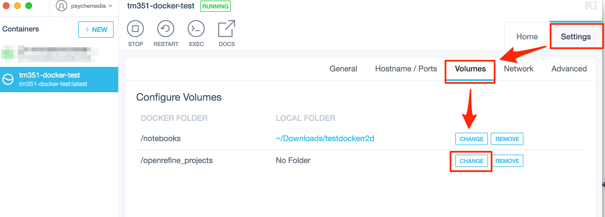

# TM351 Build

Build repo for TM351 VM. Originally developed as a VirtualBox virtual machine provisioned under vagrant, the intention is to move to Docker.

## `Docker`

An image has been pushed to Dockerhub as `ousefuldemos/tm351-docker-test`.

Run it as:

`docker run --name tm351test --rm -d -p 8895:8888 -v $PWD/notebooks:/notebooks -v $PWD/openrefine_projects:/openrefine_projects ousefuldemos/tm351-docker-test`

Alternatively, use Kitematic (from the Docker menu), search for `tm351-docker-test` and create a new container from that. You should be able to map local directories onto `$HOME/notebooks` and`$HOME/openrefine_projects` directories inside the container from the container's *Settings / Volumes* tab.



If you want to build an image yourself, you can. The Docker build currently stages the build over a stack of Docker containers, with build stages corresponding to steps in the original `vagrant` build. I suspect the layers are pretty inefficient...

To build the image (which at the moment *does not* include the sharded mongo environment), download and unzip, or clone this repo, `cd` into it from a terminal command line, run:

`./build/docker_monolothic_build.sh`

The image is named `p/t` and a container is launched from it; services can be found on `localhost` ports 8899 (notebook server) and 8898 (OpenRefine) enabled. OpenRefine can also be accessed on `localhost:8899/proxy/3334/`.


## `vagrant`

Install a recent version of vagrant and Virtualbox

Speed up repeated builds
`vagrant plugin install vagrant-cachier`

Use correct Guest Additions
`vagrant plugin install vagrant-vbguest`


Cloud host provisioners:
- `vagrant plugin install vagrant-aws`
- `vagrant plugin install vagrant-azure`
- `vagrant plugin install vagrant-digitalocean`
- `vagrant plugin install vagrant-linode`
- `vagrant plugin install vagrant-openstack-provider`

### Build with vagrant:

`vagrant up`

Jupyter notebook: port *35100*
OpenRefine: port *35101*

*If it fails and on re-privision gives an apt lock error:*
- `sudo rm /var/lib/apt/lists/lock`
- `sudo rm /var/cache/apt/archives/lock`
- `sudo rm /var/lib/dpkg/lock`


For web host provisioning:

- `vagrant up --provider=digital ocean: export DIGITAL_OCEAN_TOKEN="YOUR TOKEN HERE"`
- `vagrant up --provider=linode: export LINODE_API_KEY="YOUR KEY HERE"`


Web host provisioning set a password for authenticated access to service.

Set the environment variable from the command line:

 - password for authenticated services (default is: *tm351*): `export TMP_PASS="123"`

There is an example of this running in the current build... (see port *35188* for welcome page and ports *35180*/*35181* for authenticated access (user: __tm351__, (default) password: __tm351__).

Handy: find where an environment variable may be set: `!grep -rs HOME /etc ~/.[!.]*`

Handy: find home directory for specified user: `USERPATH="$(getent passwd $USERNAME | cut -d: -f6)"`

Accessing environment vars in Jupyter notebooks run as a service: in service definition file, use `Environment=MYENVVAR=/my/value` as part of  `[Service]` definition.

Shell testing python package install:
```
%%bash
pycheck=0
#clear pynoinstall file
> pynoinstall.txt
for P in folium  pasndas
do
if python3 -c "import $P" &> /dev/null; then
    echo "import test pass: $P"
else
echo "import test fail: $P"
echo $P >> pynoinstall.txt
pycheck=1
fi
done
if [ "$pycheck" = 0 ] ; then
touch pypackages.done
fi
```

## Run with docker:
`docker-compose up` (docker needs to be running!)

## Packaging the box

- `vagrant package --output NAME`

eg NAME: tm351_18j

THen upload to vagant cloud - https://app.vagrantup.com/

## Build AWS AMI:

Need to set up a security group to accept traffic on service ports cia (AWS Security Credentials console)[https://console.aws.amazon.com/iam/home?nc2=h_m_sc#/security_credential].

`zip -r quickbuild.zip quickbuild -x *.vagrant* -x *.DS_Store -x *.git* -x *.ipynb_checkpoints* -x *.scraps* *.pem*`

`mkdir -p toupload && zip -r toupload/quickbuild.zip quickbuild -x *.vagrant* -x *.DS_Store -x *.git* -x *.ipynb_checkpoints* -x *.pem*`
 
Pack the machine:
`packer build -var 'aws_access_key=YOUR_KEY' -var 'aws_secret_key=YOUR_SECRET' awspacker.json`

Also need to take care bringing the machine down. See running (metered) items via [console](https://eu-west-1.console.aws.amazon.com). *Remove the AMI by first deregistering it on the AWS AMI management page. Next, delete the associated snapshot on the AWS snapshot management page.*

## Associated blog posts

[Course Apps in the the Cloud – Experimenting With Open Refine on Digital Ocean, Linode and AWS / Amazon EC2 Web Services](https://blog.ouseful.info/2017/03/30/course-apps-in-the-the-cloud-experimenting-with-open-refine-on-digital-ocean-linode-and-aws-amazon-ec2-web-services/)

[Simple Authenticated Access to VM Services Using NGINX and Vagrant Port Forwarding](https://blog.ouseful.info/2017/04/03/simple-authenticated-access-to-vm-services-using-nginx-and-vagrant-port-forwarding/)

[Getting Web Services Up and Running on Amazon Web Services (AWS) Using Vagrant and the AWS CLI](https://blog.ouseful.info/2017/04/06/getting-web-services-up-and-running-on-amazon-web-services-aws-using-vagrant-and-the-aws-cli/)

[Getting Web Services Up and Running on MicroSoft Azure Using Vagrant and the Azure CLI](https://blog.ouseful.info/2017/04/06/getting-web-services-up-and-running-on-microsoft-azure-using-vagrant-and-the-azure-cli/)

## TO DO

The mongo shard server uses fixed `sleep` time to wait for services to come up; really should monitor status of mongo (eg look in `tail` of log file for "listening" or similar is one trick I saw somewhere?) as the guard.


#----

zipper:
`zip -r tm351_builder_unversioned.zip tm351_builder_unversioned -x *.vagrant* -x *openrefine_proj* -x *.DS_Store -x *.git* -x *.ipynb_checkpoints* -x *.scraps* -x *quick* -x *logs/* -x *touploa* -x *.dbshell* -x *.pem*`


## Versioning

Linux packages: `dpkg -l` or `sudo apt-get install -y apt-show-versions && apt-show-versions`

Python packages: `pip3 freeze`

??But how can we easily use this info for a *build-to-versions* build?

Old `apt-get` packages probably not available in current package archive?

For python, maybe:

- build machine
- `pip3 freeze  > requirements_THISBUILD.txt` then use `pip3 install -r requirements_THISBUILD.txt` and disable or ignore other `pip3` install items (may need some work on build files? Maybe wrap them in a test of a `$REBUILD` environment variable?)

## Debug
`systemctl list-units | grep mongo`
`sudo lsof -iTCP -sTCP:LISTEN | grep mongo`
`journalctl -u mongodb.service`

## BUILDING

`vagrant up && vagrant reload` so updates are properly installed